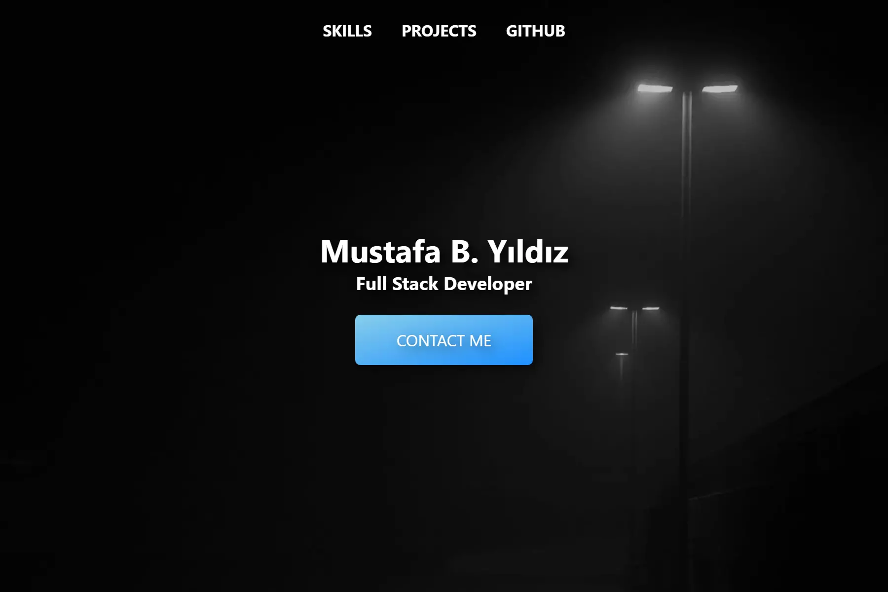

# My Portfolio
My Portfolio Site v3



## How to start developing
All you need is

- yarn
- node

Firstly, install dependencies with `yarn`. Then, you can do:
``` sh
$ yarn watch
```
Which starts a live-updating server.

Alternatively, you can do `yarn start` to serve compiled output.